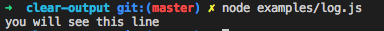

# clear-output

[](https://npmjs.com/package/clear-output) [](https://npmjs.com/package/clear-output)

> A cli utils that can clear your terminal output.

## Install

```bash
yarn add clear-output
```

## Usage

```js
const clear = require('clear-output')

const str = 'you will see this line\nyou won\'t see \nthese lines'

console.log(str)

clear(str)
```

And you will see this:



## Contributing

1. Fork it!
2. Create your feature branch: `git checkout -b my-new-feature`
3. Commit your changes: `git commit -am 'Add some feature'`
4. Push to the branch: `git push origin my-new-feature`
5. Submit a pull request :D


## Author

**clear-output** © [lijsh](https://github.com/lijsh), Released under the [MIT](./LICENSE) License.<br>
Authored and maintained by lijsh with help from contributors ([list](https://github.com/lijsh/clear-output/contributors)).

> [github.com/lijsh](https://github.com/lijsh) · GitHub [@lijsh](https://github.com/lijsh) · Twitter [@lijiashen](https://twitter.com/lijiashen)
